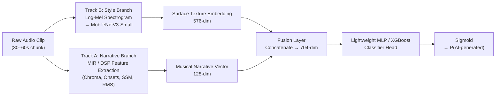
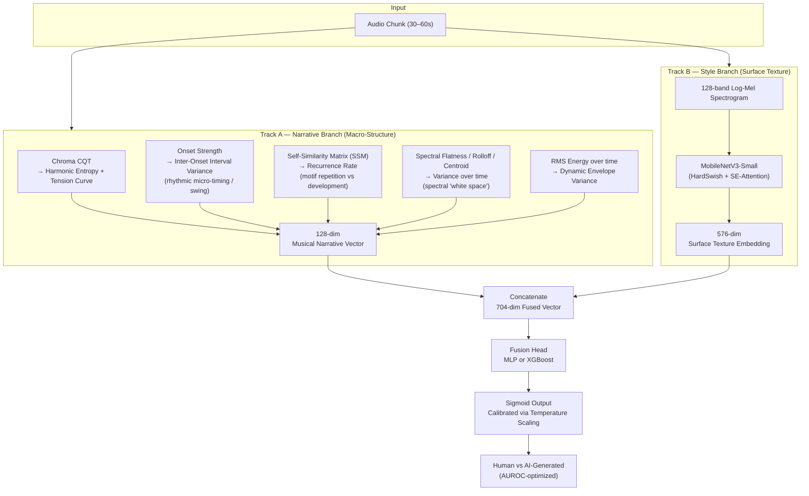
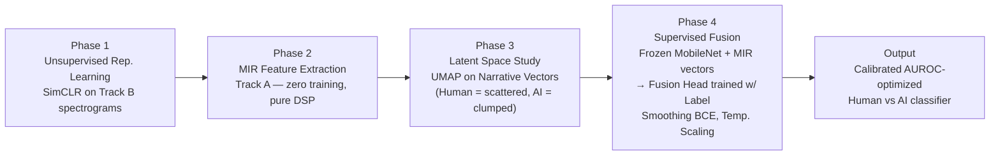

# MusicScope

**Detecting AI-Generated Music by Modeling Musical "Narrative Logic," not just Audio Texture.**

MusicScope is our submission architecture for **MIREX 2026 — AI-Generated Music Detection**. It is directly inspired by **StoryScope**, an NLP paper whose core insight was:

> Surface-level style (word choice, syntax) is easy for AI to fake. Deep narrative structure (plot causality, thematic development, non-linear time) is where AI still fails to mimic human creativity.

We translate that exact philosophy from **text → audio**:

| Domain | Surface Layer (fakeable) | Structural Layer (hard to fake) |
|---|---|---|
| Text (StoryScope) | Vocabulary, syntax, em-dashes | Plot causality, thematic arcs, non-linear time |
| Music (MusicScope) | Vocoder artifacts, spectral smearing, phase noise | Harmonic tension, motivic development, rhythmic groove, dynamic arcs |

As generators like Suno v5 and Udio get better at hiding surface artifacts, they still struggle to fake **musical intent** — the long-range structural logic a human composer/producer brings to a track. MusicScope is built to catch exactly that.

---

## Core Idea

We don't feed raw audio into one giant model. We split detection into two specialized branches — one for **style**, one for **narrative structure** — and fuse them, mirroring StoryScope's separation of LLM-derived narrative features from surface text features.



---

## The Rosetta Stone: Text Narrative → Music Structure

This is the conceptual translation table that the entire project is built on.

| StoryScope (Text) | MusicScope (Audio) | The AI "Tell" |
|---|---|---|
| Thematic Explicitness | Motivic Development | AI loops perfectly; humans vary and develop motifs |
| Chronological Discontinuity | Structural Transitions & Form | AI fades in/out; humans use fills, drops, harmonic pivots |
| Moral Ambiguity | Harmonic & Rhythmic Tension | AI resolves cleanly (I–IV–V–I); humans use dissonance, swing |
| Sensory Density | Timbral Clutter / Spectral Density | AI fills all frequency bands; humans leave "space" |
| Narrative Rarity | Dynamic Arc Rarity | AI's loudness curve is flat/linear; humans shape it non-linearly |

---

## Full Architecture Blueprint



---

## Narrative Feature Details (Track A)

All four features are pure signal-processing — **no training required** — computed with `librosa` / `essentia`.

1. **Harmonic Ambiguity & Tension** — `librosa.feature.chroma_cqt` → harmonic entropy + bass/root dissonance curve.
   *Tell:* AI stays rigidly in-key (low entropy); humans use modal mixture and borrowed chords.

2. **Rhythmic Micro-Deviation** — `librosa.onset.onset_strength` → Inter-Onset Interval (IOI) variance.
   *Tell:* AI is grid-quantized (near-zero variance); humans have groove/swing (high variance).

3. **Motivic Repetition vs. Development** — Self-Similarity Matrix over chroma/mel → recurrence rate.
   *Tell:* AI loops the same 4 bars; humans develop themes (low recurrence, high structural variance).

4. **Spectral "White Space"** — Spectral flatness, rolloff, centroid variance over time.
   *Tell:* AI vocoders smear energy across all bands; human mixes leave dynamic space.

---

## Experimental Plan / Pipeline



**Hypothesis (Phase 3):** UMAP projection of narrative vectors will show human tracks scattered widely (high structural rarity), while AI tracks cluster tightly ("AI convergence").

---

## Why This for MIREX 

- **Immune to post-processing / "de-artifacting":** Even if Track B (style) is fooled by a plugin that removes vocoder artifacts, Track A (narrative) still catches the lack of harmonic tension and micro-timing — that can't be patched with a filter.
- **Maximizes AUROC on hard cases:** The hardest cases are AI tracks that sound sonically clean. Structural logic separates "sonically perfect but soulless" from "messy but structurally rich."
- **Lightweight & fast:** MobileNetV3-Small (~2.5M params) + millisecond-level DSP feature extraction + a tiny fusion MLP → comfortably fits the 24-hour, single-GPU MIREX constraint.

---

## Repo Structure

```
musicscope/
├── README.md                  # this file
├── ARCHITECTURE.md            # deep-dive on design decisions
├── requirements.txt           # dependencies
├── src/
│   ├── track_a_narrative.py   # MIR/DSP feature extractor
│   ├── track_b_style.py       # MobileNetV3 spectrogram branch
│   ├── fusion_model.py        # fusion head (MLP/XGBoost)
│   ├── train_simclr.py        # Phase 1: unsupervised pretraining
│   └── umap_analysis.py       # Phase 3: latent space visualization
├── notebooks/
│   └── exploration.ipynb
└── data/
    └── README.md              # dataset notes (not tracked in git)
```

---

## Quickstart

```bash
git clone https://github.com/<[text](https://github.com/isdp0415-droid)>/musicscope.git
cd musicscope
pip install -r requirements.txt

# Phase 2: extract narrative features (no training needed)
python src/track_a_narrative.py --input_dir ./data/raw --output narrative_vectors.parquet

# Phase 1: pretrain style branch
python src/train_simclr.py --input_dir ./data/raw

# Phase 4: train fusion head
python src/fusion_model.py --narrative narrative_vectors.parquet --style_ckpt simclr.pt
```

---

## Citation / Inspiration

This project's methodology is adapted from the **StoryScope** paper's approach to AI-text detection via narrative-structure features, reapplied to the audio domain via Music Information Retrieval (MIR) techniques.

---

## Status

 Active development for MIREX 2026 submission. Contributions and issue reports welcome.
